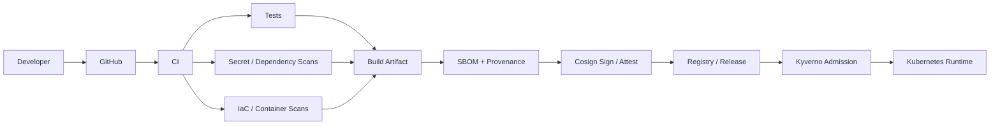

# DevSecOps Supply Chain Security Platform

<p align="center"><strong>Secure the path from source code to runtime.</strong></p>

<p align="center">


</p>

A practical secure software delivery platform demonstrating defense-in-depth controls across source, dependencies, infrastructure, containers, Kubernetes, artifacts, and releases.

> **Reviewing this for a role?** Start with the [5-minute recruiter/interview walkthrough](docs/recruiter-walkthrough.md) for a fast path through the security engineering evidence.

## Architecture



## Security gates

| Layer | Control | Purpose |
|---|---|---|
| Source | Gitleaks / dependency review | Prevent credential and dependency risk |
| Code | Tests / static checks | Catch defects before release |
| IaC | Checkov | Detect insecure infrastructure patterns |
| Container | Trivy / Grype | Identify image vulnerabilities |
| Supply chain | SBOM / provenance / Cosign | Establish artifact evidence |
| Kubernetes | Kyverno / NetworkPolicy | Enforce deployment controls |
| Policy | OPA / Conftest | Validate policy as code |
| Operations | Severity SLAs / runbooks | Drive measurable remediation |

## Security flow

**Scan → Build → Generate evidence → Sign → Verify → Admit → Monitor → Respond**

## Recruiter evidence path

- [Recruiter / Interview Walkthrough](docs/recruiter-walkthrough.md)
- `.github/` — CI security gates and release automation
- policy files — admission and policy-as-code controls
- scanning configuration — source, IaC and container security evidence
- SBOM/signing/provenance logic — software supply-chain integrity
- operational guidance — remediation and response expectations

## Quick start

```bash
make test
make security
make build
```

The local security target intentionally runs tools only when installed; CI uses pinned action/tool versions where practical.

## Keyless signing

The release workflow contains a real-world GitHub OIDC/Cosign pattern. It is designed to run in GitHub Actions with an OCI registry and does not store long-lived signing keys in the repository. Verification uses the image digest rather than a mutable tag.

## Engineering principles

1. Fail closed on high-confidence security gates.
2. Prefer short-lived identity over static credentials.
3. Generate evidence as part of delivery.
4. Verify artifacts at deployment boundaries.
5. Treat policy as versioned code and test it.
6. Make remediation measurable with severity-based SLAs.

## Scope

**Status:** portfolio/reference implementation. It does not claim that production infrastructure or a live registry is currently deployed. Secrets and credentials are never committed.

## Recruiter signal

This repository demonstrates how a platform engineer can secure the complete software supply chain while preserving developer self-service.
