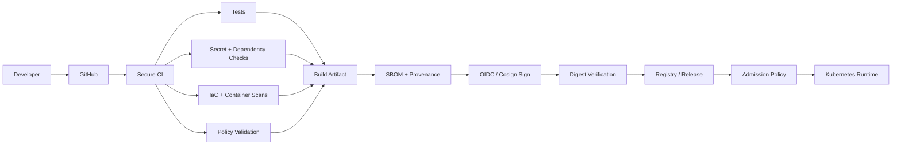

# DevSecOps Supply Chain Security Platform

<p align="center"><strong>Secure the delivery path from source commit to Kubernetes admission.</strong></p>

<p align="center">
<a href="https://github.com/obinna-obika-devops/devsecops-supply-chain-security/actions/workflows/secure-ci.yml"></a>
<a href="https://github.com/obinna-obika-devops/devsecops-supply-chain-security/actions/workflows/security.yml"></a>


</p>

## Engineering problem

Modern delivery pipelines have several trust boundaries: source code, third-party dependencies, infrastructure definitions, container images, build artifacts and the Kubernetes admission layer. A pipeline can pass functional tests and still ship exposed credentials, vulnerable dependencies, insecure infrastructure, a compromised image or an artifact whose provenance cannot be established.

This repository implements a **defense-in-depth DevSecOps delivery path** that moves security controls earlier in CI while preserving artifact integrity through release and deployment boundaries.

## What was built

- Pull-request and main-branch security gates for application tests, secrets, IaC, containers and policy
- Container builds identified by immutable commit/digest context rather than relying only on mutable tags
- SBOM and provenance generation during release builds
- Keyless container signing with Cosign and GitHub OIDC
- Signature verification against the immutable image digest
- Kubernetes admission and runtime policy patterns using Kyverno and NetworkPolicy
- OPA/Conftest policy-as-code validation
- Severity-based remediation guidance and operational security controls

## Delivery architecture



## Security evidence

| Security concern | Repository evidence |
|---|---|
| CI security gates | [`.github/workflows/secure-ci.yml`](.github/workflows/secure-ci.yml) |
| Release integrity | [`.github/workflows/release.yml`](.github/workflows/release.yml) |
| Security analysis | [`.github/workflows/security.yml`](.github/workflows/security.yml) |
| Infrastructure security | [`terraform/`](terraform/) |
| Application/container build | [`app/`](app/) |
| Policy as code | [`security/policy/`](security/policy/) |
| Kubernetes controls | [`kubernetes/`](kubernetes/) |
| Supply-chain automation | [`.github/workflows/`](.github/workflows/) |

## Security gates

| Layer | Control | Engineering purpose |
|---|---|---|
| Source | Gitleaks / dependency controls | Reduce credential and dependency risk before merge |
| Application | Tests / static analysis | Catch defects before an artifact is produced |
| Infrastructure | Checkov | Detect insecure IaC patterns before provisioning |
| Container | Trivy / Grype patterns | Block high-impact image vulnerabilities |
| Policy | OPA / Conftest | Validate deployment requirements as versioned code |
| Supply chain | SBOM / provenance / Cosign | Establish what was built, how it was built and who signed it |
| Kubernetes | Kyverno / NetworkPolicy | Enforce controls at the deployment/runtime boundary |
| Operations | Severity SLAs / runbooks | Make remediation explicit and measurable |

## Release trust model

The release workflow is intentionally different from a basic image build:

1. Build and push the container image.
2. Generate SBOM and provenance metadata with the build.
3. Obtain short-lived workload identity through GitHub OIDC.
4. Sign the resulting image digest with Cosign instead of storing a long-lived signing key in the repository.
5. Verify the signature against the digest and expected GitHub Actions identity.
6. Treat admission policy as a separate deployment trust boundary.

The important design decision is that **build success alone is not sufficient evidence for deployment**. Security evidence travels with the artifact and can be checked again at later boundaries.

## CI failure behavior

Security checks are designed to act as delivery gates rather than informational decoration. High/critical container findings configured by the workflow fail the relevant job, IaC scanning is configured not to soft-fail, and policy validation is part of CI. This makes security findings visible before release rather than depending only on post-deployment review.

## Key engineering decisions

**Short-lived identity over static signing secrets.** GitHub OIDC and Cosign reduce the need to maintain long-lived signing key material inside CI.

**Digest-based verification.** Release verification targets the immutable image digest rather than trusting a mutable container tag.

**Policy as code.** Infrastructure and Kubernetes expectations are represented as reviewable, version-controlled controls that can run automatically in CI and admission workflows.

**Evidence generated during delivery.** SBOM and provenance generation are part of the build/release path rather than a separate manual documentation exercise.

**Layered controls.** No individual scanner is treated as the complete security solution; source, dependency, infrastructure, container, artifact and runtime controls address different failure modes.

## Security flow

**Scan → Test → Build → Generate evidence → Sign → Verify → Admit → Monitor → Respond**

## Quick start

```bash
make test
make security
make build
```

The local security target runs supported tools when installed. CI contains the authoritative automated security gates.

## Engineering principles

1. Fail closed on high-confidence security gates.
2. Prefer short-lived identity over static credentials.
3. Generate security evidence as part of delivery.
4. Verify immutable artifacts at trust boundaries.
5. Treat policy as versioned, testable code.
6. Make remediation measurable with severity-based priorities.

## Scope

This is a **working reference implementation** of secure software-delivery controls. It demonstrates the pipeline logic, policies and security boundaries in code without claiming that a production registry, Kubernetes environment or customer workload is currently operated from this repository.